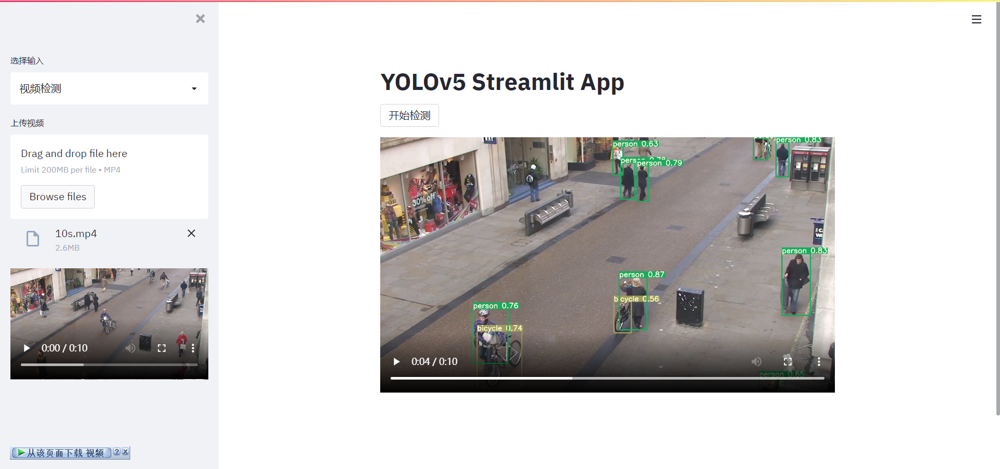

# yolov5-streamlit

Deploy [YOLOv5](https://github.com/ultralytics/yolov5/releases/tag/v5.0) detection with [Streamlit](https://github.com/streamlit/streamlit)


# Installation of Dependencies

```
# For local installation, replace opencv-python-headless with opencv-python
pip install -r requirements.txt
```

If you have a GPU, replace torch with the GPU version for accelerated detection.

# Running the Project
```
streamlit run main.py
```

**Image Detection**


**Video Detection**

